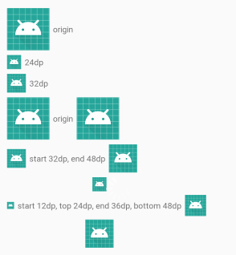

# DrawableTextView



### example

```xml
<me.temoa.drawabletextview.DrawableTextView
    android:layout_width="wrap_content"
    android:layout_height="wrap_content"
    android:layout_marginTop="8dp"
    android:drawableBottom="@mipmap/ic_launcher"
    android:drawableEnd="@mipmap/ic_launcher"
    android:drawablePadding="6dp"
    android:drawableStart="@mipmap/ic_launcher"
    android:drawableTop="@mipmap/ic_launcher"
    android:gravity="center"
    android:text="start 12dp, top 24dp, end 36dp, bottom 48dp"
    app:dtv_bottom_height="48dp"
    app:dtv_bottom_width="48dp"
    app:dtv_end_height="36dp"
    app:dtv_end_width="36dp"
    app:dtv_start_height="12dp"
    app:dtv_start_width="12dp"
    app:dtv_top_height="24dp"
    app:dtv_top_width="24dp" />
```
### xml attribute

xml attribute | description 
--- | ---
dtv_start_width | start drawble width
dtv_start_height | start drawable height
dtv_end_width | end drawble width
dtv_end_height | end drawble height
dtv_top_width | top drawble width
dtv_top_height | top drawble height
dtv_bottom_width | bottom drawble width
dtv_bottom_height | bottom drawble height
